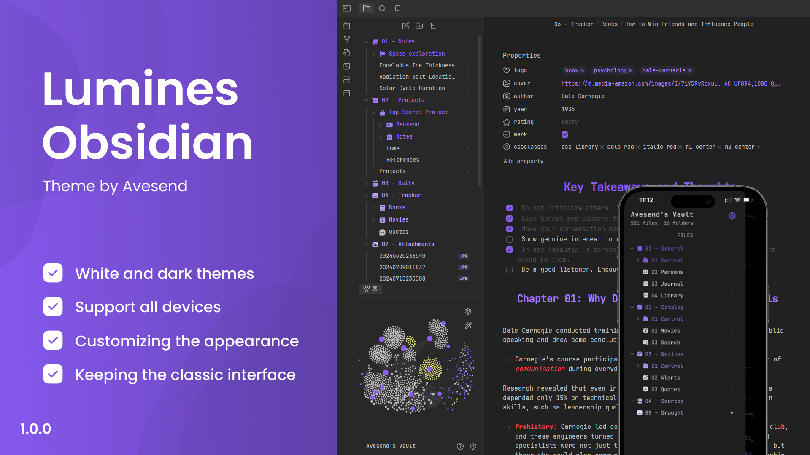

<h1>Obsidian Lumines</h1>
<a href="https://github.com/Avesend/obsidian-lumines">Star Us on GitHub</a> ⭐️ <a href="https://github.com/Avesend/obsidian-lumines/issues">Request Feature</a>

Lumines is a theme for Obsidian that improves the default style and fixes interface issues, enhancing usability and accessibility without drastic changes. The theme also includes useful additions that make note-taking more comfortable and enjoyable, encouraging users to return to their workspace.

<h2>Icons for each type of property</h2>

Icons in a unified style have been added, which automatically change depending on the type of properties, ensuring quick visual identification of data. Various property types are supported, including text, lists, numbers, dates, and others.

<h2>Custom icons for property names</h2>

Choose the appropriate icon based on the value of the properties. Over 40 icons are available to choose from. Icons change depending on the property names and are independent of their types, making the process flexible and convenient.

   
Available icons

   

      <ul>
         <li>tags</li>
         <li>time</li>
         <li>cssclasses</li>
         <li>birthday</li>
         <li>aliases</li>
         <li>save</li>
         <li>lovely</li>
         <li>camera</li>
         <li>radio</li>
         <li>music</li>
         <li>music</li>
         <li>subject</li>
         <li>related</li>
         <li>note</li>
         <li>number</li>
         <li>purpose</li>
         <li>city</li>
         <li>address</li>
         <li>passport</li>
         <li>issued</li>
         <li>game</li>
         <li>weight</li>
         <li>ticket</li>
         <li>bankcard</li>
         <li>snils</li>
         <li>socials</li>
         <li>email</li>
         <li>source</li>
         <li>cover</li>
         <li>author</li>
         <li>rating</li>
         <li>year</li>
         <li>link</li>
         <li>timer</li>
         <li>briefcase</li>
         <li>award</li>
         <li>book</li>
         <li>location</li>
         <li>map</li>
         <li>status</li>
         <li>bookid</li>
         <li>bag</li>
         <li>box</li>
         <li>reserve</li>
         <li>key</li>
         <li>youtube</li>
      </ul>
   

<h2>The appearance of the workspace</h2>

Create unique visual solutions. Seamlessly change the appearance of your notes. You can use CSS classes in the property named "cssclasses" to interact with this feature. Detailed customization of notes is now possible in real-time.

   
How to use it?

   

      <ol>
         <li>Use the property named "cssclasses".</li>
         <li>Enter the values below individually.</li>
      </ol>
   

### List of values

   
Heading align

   

      <ul>
         <li>h1-center</li>
         <li>h2-center</li>
         <li>h3-center</li>
         <li>h4-center</li>
         <li>h5-center</li>
         <li>h6-center</li>
         <li>h1-end</li>
         <li>h2-end</li>
         <li>h3-end</li>
         <li>h4-end</li>
         <li>h5-end</li>
         <li>h6-end</li>
      </ul>
   

   
Heading color

   

      <ul>
         <li>h1-red</li>
         <li>h2-red</li>
         <li>h3-red</li>
         <li>h4-red</li>
         <li>h5-red</li>
         <li>h6-red</li>
         <li>h1-orange</li>
         <li>h2-orange</li>
         <li>h3-orange</li>
         <li>h4-orange</li>
         <li>h5-orange</li>
         <li>h6-orange</li>
         <li>h1-yellow</li>
         <li>h2-yellow</li>
         <li>h3-yellow</li>
         <li>h4-yellow</li>
         <li>h5-yellow</li>
         <li>h6-yellow</li>
         <li>h1-lime</li>
         <li>h2-lime</li>
         <li>h3-lime</li>
         <li>h4-lime</li>
         <li>h5-lime</li>
         <li>h6-lime</li>
         <li>h1-green</li>
         <li>h2-green</li>
         <li>h3-green</li>
         <li>h4-green</li>
         <li>h5-green</li>
         <li>h6-green</li>
         <li>h1-cyan</li>
         <li>h2-cyan</li>
         <li>h3-cyan</li>
         <li>h4-cyan</li>
         <li>h5-cyan</li>
         <li>h6-cyan</li>
         <li>h1-sky</li>
         <li>h2-sky</li>
         <li>h3-sky</li>
         <li>h4-sky</li>
         <li>h5-sky</li>
         <li>h6-sky</li>
         <li>h1-blue</li>
         <li>h2-blue</li>
         <li>h3-blue</li>
         <li>h4-blue</li>
         <li>h5-blue</li>
         <li>h6-blue</li>
         <li>h1-indigo</li>
         <li>h2-indigo</li>
         <li>h3-indigo</li>
         <li>h4-indigo</li>
         <li>h5-indigo</li>
         <li>h6-indigo</li>
         <li>h1-violet</li>
         <li>h2-violet</li>
         <li>h3-violet</li>
         <li>h4-violet</li>
         <li>h5-violet</li>
         <li>h6-violet</li>
         <li>h1-pink</li>
         <li>h2-pink</li>
         <li>h3-pink</li>
         <li>h4-pink</li>
         <li>h5-pink</li>
         <li>h6-pink</li>
         <li>h1-gray</li>
         <li>h2-gray</li>
         <li>h3-gray</li>
         <li>h4-gray</li>
         <li>h5-gray</li>
         <li>h6-gray</li>
         <li>h1-white</li>
         <li>h2-white</li>
         <li>h3-white</li>
         <li>h4-white</li>
         <li>h5-white</li>
         <li>h6-white</li>
      </ul>
   

   
Bold color

   

      <ul>
         <li>bold-red</li>
         <li>bold-orange</li>
         <li>bold-yellow</li>
         <li>bold-lime</li>
         <li>bold-green</li>
         <li>bold-cyan</li>
         <li>bold-sky</li>
         <li>bold-blue</li>
         <li>bold-indigo</li>
         <li>bold-violet</li>
         <li>bold-pink</li>
         <li>bold-gray</li>
         <li>bold-white</li>
      </ul>
   

   
Italic color

   

      <ul>
         <li>italic-red</li>
         <li>italic-orange</li>
         <li>italic-yellow</li>
         <li>italic-lime</li>
         <li>italic-green</li>
         <li>italic-cyan</li>
         <li>italic-sky</li>
         <li>italic-blue</li>
         <li>italic-indigo</li>
         <li>italic-violet</li>
         <li>italic-pink</li>
         <li>italic-gray</li>
         <li>italic-white</li>
      </ul>
   

   
Quote color

   

      <ul>
         <li>quote-red</li>
         <li>quote-orange</li>
         <li>quote-yellow</li>
         <li>quote-lime</li>
         <li>quote-green</li>
         <li>quote-cyan</li>
         <li>quote-sky</li>
         <li>quote-blue</li>
         <li>quote-indigo</li>
         <li>quote-violet</li>
         <li>quote-pink</li>
         <li>quote-gray</li>
         <li>quote-white</li>
      </ul>
   

<h2>All callouts have been updated</h2>

Callouts have been completely redesigned. Some visual bugs have been fixed, and improvements have been made to their appearance. Each callout now has an updated icon and a changed accent color.

   
New callouts

   

      <ul>
         <li>>[!like] Callout</li>
         <li>>[!dislike] Callout</li>
         <li>>[!star] Callout</li>
         <li>>[!image] Callout</li>
         <li>>[!list] Callout</li>
         <li>>[!alert] Callout</li>
         <li>>[!sort] Callout</li>
      </ul>
   

<h2>How to start using the theme?</h2>
<ol>
   <li>Navigate to <b>Appearance</b> in the settings menu.</li>
   <li>Click on <b>Manage</b> under the <b>Themes</b> section.</li>
   <li>In the search, <b>enter</b> the theme name "<b>Lumines</b>".</li>
</ol>

If there are problems with installing Lumines, you can get more information about it <a href="https://help.obsidian.md/Extending+Obsidian/Themes">here</a>.

<h2>Suggestions for improvement</h2>
If you have any questions or suggestions, please report the <a href="https://github.com/Avesend/obsidian-lumines/issues">issue</a> or submit a <a href="https://github.com/Avesend/obsidian-lumines/pulls">pull request</a>.