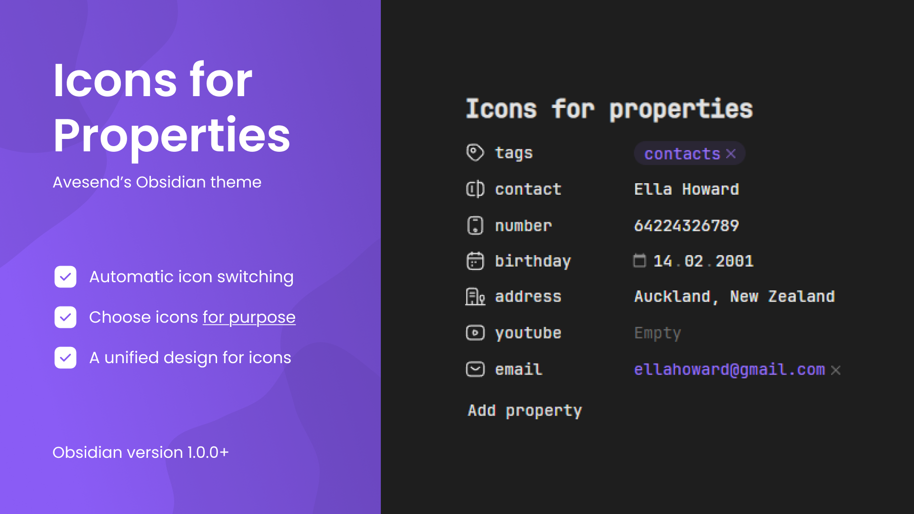

<h1>Obsidian Lumines</h1>
<a href="https://github.com/Avesend/obsidian-lumines">Star Us on GitHub</a> ⭐️ <a href="https://github.com/Avesend/obsidian-lumines/issues">Request Feature</a>

Lumines is an Obsidian theme that refines the default style and addresses interface issues, improving usability and accessibility while keeping the original look. It also adds useful enhancements for better note-taking.

<h2>Properties Icons (1/2)</h2>

Unified icons automatically adapt to property types such as text, lists, numbers, and dates, maintaining a clean and consistent visual style across all data types.

<h2>Properties Icons (2/2)</h2>

Choose from over 45 icons that can be assigned to property names. These icons are not tied to property types, giving you more flexibility to personalize your workspace.

   
Available icons

   

      <ul>
         <li>aliases</li>
         <li>tags</li>
         <li>cssclasses</li>
         <li>time</li>
         <li>birthday</li>
         <li>number</li>
         <li>city</li>
         <li>address</li>
         <li>passport</li>
         <li>issued</li>
         <li>bankcard</li>
         <li>snils</li>
         <li>socials</li>
         <li>email</li>
         <li>purpose</li>
         <li>sources</li>
         <li>bookid</li>
         <li>cover</li>
         <li>author</li>
         <li>rating</li>
         <li>year</li>
         <li>link</li>
         <li>subject</li>
         <li>save</li>
         <li>lovely</li>
         <li>camera</li>
         <li>radio</li>
         <li>music</li>
         <li>wallet</li>
         <li>note</li>
         <li>game</li>
         <li>weight</li>
         <li>ticket</li>
         <li>timer</li>
         <li>briefcase</li>
         <li>award</li>
         <li>book</li>
         <li>location</li>
         <li>map</li>
         <li>bag</li>
         <li>box</li>
         <li>reserve</li>
         <li>key</li>
         <li>youtube</li>
      </ul>
   

<h2>Content Formatting</h2>

Use the <b>cssclasses</b> property to assign custom CSS classes and modify note designs. This feature supports instant updates, allowing you to refine your workspace effortlessly.

   
How to use it?

   

      <ol>
         <li>Open the note and find its frontmatter section.</li>
         <li>Add the cssclasses property below the metadata.</li>
         <li>Use styles like bold-indigo or highlight-white.</li>
      </ol>
   

### List of values

   
Heading align

   

      <ul>
         <li>h1-center</li>
         <li>h2-center</li>
         <li>h3-center</li>
         <li>h4-center</li>
         <li>h5-center</li>
         <li>h6-center</li>
         <li>h1-end</li>
         <li>h2-end</li>
         <li>h3-end</li>
         <li>h4-end</li>
         <li>h5-end</li>
         <li>h6-end</li>
      </ul>
   

   
Heading color

   

      <ul>
         <li>h1-red</li>
         <li>h2-red</li>
         <li>h3-red</li>
         <li>h4-red</li>
         <li>h5-red</li>
         <li>h6-red</li>
         <li>h1-orange</li>
         <li>h2-orange</li>
         <li>h3-orange</li>
         <li>h4-orange</li>
         <li>h5-orange</li>
         <li>h6-orange</li>
         <li>h1-yellow</li>
         <li>h2-yellow</li>
         <li>h3-yellow</li>
         <li>h4-yellow</li>
         <li>h5-yellow</li>
         <li>h6-yellow</li>
         <li>h1-lime</li>
         <li>h2-lime</li>
         <li>h3-lime</li>
         <li>h4-lime</li>
         <li>h5-lime</li>
         <li>h6-lime</li>
         <li>h1-green</li>
         <li>h2-green</li>
         <li>h3-green</li>
         <li>h4-green</li>
         <li>h5-green</li>
         <li>h6-green</li>
         <li>h1-cyan</li>
         <li>h2-cyan</li>
         <li>h3-cyan</li>
         <li>h4-cyan</li>
         <li>h5-cyan</li>
         <li>h6-cyan</li>
         <li>h1-sky</li>
         <li>h2-sky</li>
         <li>h3-sky</li>
         <li>h4-sky</li>
         <li>h5-sky</li>
         <li>h6-sky</li>
         <li>h1-blue</li>
         <li>h2-blue</li>
         <li>h3-blue</li>
         <li>h4-blue</li>
         <li>h5-blue</li>
         <li>h6-blue</li>
         <li>h1-indigo</li>
         <li>h2-indigo</li>
         <li>h3-indigo</li>
         <li>h4-indigo</li>
         <li>h5-indigo</li>
         <li>h6-indigo</li>
         <li>h1-violet</li>
         <li>h2-violet</li>
         <li>h3-violet</li>
         <li>h4-violet</li>
         <li>h5-violet</li>
         <li>h6-violet</li>
         <li>h1-pink</li>
         <li>h2-pink</li>
         <li>h3-pink</li>
         <li>h4-pink</li>
         <li>h5-pink</li>
         <li>h6-pink</li>
         <li>h1-gray</li>
         <li>h2-gray</li>
         <li>h3-gray</li>
         <li>h4-gray</li>
         <li>h5-gray</li>
         <li>h6-gray</li>
         <li>h1-white</li>
         <li>h2-white</li>
         <li>h3-white</li>
         <li>h4-white</li>
         <li>h5-white</li>
         <li>h6-white</li>
      </ul>
   

   
Bold color

   

      <ul>
         <li>bold-red</li>
         <li>bold-orange</li>
         <li>bold-yellow</li>
         <li>bold-lime</li>
         <li>bold-green</li>
         <li>bold-cyan</li>
         <li>bold-sky</li>
         <li>bold-blue</li>
         <li>bold-indigo</li>
         <li>bold-violet</li>
         <li>bold-pink</li>
         <li>bold-gray</li>
         <li>bold-white</li>
      </ul>
   

   
Italic color

   

      <ul>
         <li>italic-red</li>
         <li>italic-orange</li>
         <li>italic-yellow</li>
         <li>italic-lime</li>
         <li>italic-green</li>
         <li>italic-cyan</li>
         <li>italic-sky</li>
         <li>italic-blue</li>
         <li>italic-indigo</li>
         <li>italic-violet</li>
         <li>italic-pink</li>
         <li>italic-gray</li>
         <li>italic-white</li>
      </ul>
   

   
Quote color

   

      <ul>
         <li>quote-red</li>
         <li>quote-orange</li>
         <li>quote-yellow</li>
         <li>quote-lime</li>
         <li>quote-green</li>
         <li>quote-cyan</li>
         <li>quote-sky</li>
         <li>quote-blue</li>
         <li>quote-indigo</li>
         <li>quote-violet</li>
         <li>quote-pink</li>
         <li>quote-gray</li>
         <li>quote-white</li>
      </ul>
   

   
Highlight color

   

      <ul>
         <li>highlight-red</li>
         <li>highlight-orange</li>
         <li>highlight-yellow</li>
         <li>highlight-lime</li>
         <li>highlight-green</li>
         <li>highlight-cyan</li>
         <li>highlight-sky</li>
         <li>highlight-blue</li>
         <li>highlight-indigo</li>
         <li>highlight-violet</li>
         <li>highlight-pink</li>
         <li>highlight-gray</li>
         <li>highlight-white</li>
      </ul>
   

<h2>Updated Callouts</h2>

Callouts now feature redesigned icons, refreshed accent colors, and resolved visual issues. These improvements enhance their appearance and usability.

   
New callouts

   

      <ul>
         <li>>[!like] Callout</li>
         <li>>[!dislike] Callout</li>
         <li>>[!star] Callout</li>
         <li>>[!image] Callout</li>
         <li>>[!list] Callout</li>
         <li>>[!alert] Callout</li>
         <li>>[!sort] Callout</li>
      </ul>
   

<h2>Alternate Checkbox</h2>

Customizable checkboxes now offer more flexibility with alternate symbols. You can replace the default "x" with any other symbol to alter the checkbox appearance.

   
New checkboxes

   

      <ul>
         <li>[c] checkmark</li>
         <li>[C] cross</li>
         <li>[+] plus</li>
         <li>[-] minus</li>
         <li>[!] exclamation</li>
         <li>[?] question</li>
         <li>[s] search</li>
         <li>[o] circle</li>
         <li>[U] up</li>
         <li>[D] down</li>
         <li>[l] like</li>
         <li>[d] dislike</li>
         <li>[*] star</li>
         <li>[h] heart</li>
         <li>[S] shield</li>
         <li>[k] key</li>
         <li>[I] idea</li>
         <li>[A] alert</li>
         <li>[$] dollar</li>
         <li>[i] in-progress</li>
         <li>[p] play</li>
         <li>[P] pause</li>
         <li>[R] repeat</li>
         <li>[L] location</li>
         <li>[u] undo</li>
         <li>[r] redo</li>
         <li>[>] calendar</li>
         <li>[=] calculator</li>
         <li>[t] text</li>
         <li>[T] translate</li>
         <li>[q] quote</li>
      </ul>
   

<h2>How to start using the theme?</h2>
<ol>
   <li>Navigate to <b>Appearance</b> in the settings menu.</li>
   <li>Click on <b>Manage</b> under the <b>Themes</b> section.</li>
   <li>In the search, <b>enter</b> the theme name "<b>Lumines</b>".</li>
</ol>

If there are problems with installing Lumines, you can get more information about it <a href="https://help.obsidian.md/Extending+Obsidian/Themes">here</a>.

<h2>Suggestions for improvement</h2>
If you have any questions or suggestions, please report the <a href="https://github.com/Avesend/obsidian-lumines/issues">issue</a> or submit a <a href="https://github.com/Avesend/obsidian-lumines/pulls">pull request</a>.